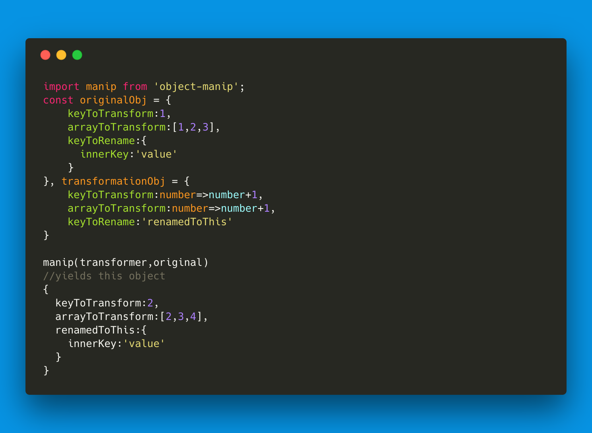

Object-Manip [](https://travis-ci.org/nperez0111/object-manip)
============
Transforms POJOs into other POJOs using POJOs.

<a href="https://github.com/nperez0111/object-manip">  </a>

Basically Array.map for Objects using Objects instead of functions. 

Installation
============

````
npm install object-manip --save
````

Usage
=======

## Simple

The basic idea is that you make a transformer object to convert one object's properties and/or data into another object.

In this example we can see that we have a transformer object and and an original object. The role of the transformer object is to direct and transform the data and properties of the original object.

Here the transformer object simply maps the a property to be its current value plus one.

````JS
var manip = require('object-manip'),
	transformer = {
			a:function(x){
				return x+1;
				}
		},
	original = {
		a:1
	};
	manip(transformer,original)
	//{ a: 2 }

````

## Reverse

You can change the order in which you prefer the transformer object and the orinal object should be in by calling `toggleReverse()`.

````JS

manip.toggleReverse();

manip(original,transformer)
//{ a: 2 }

	
````

## Array Transform

If the original data is an array the transform function will be called on each of the array items. Using Array.map internally. Your supplied function will be called with: the current value being mapped, the index of the current value, and the entire array being mapped.

In this example my transform function only adds the current index to the array element, but this could be more complicated than this.

````JS
original = {
	a:[ 1, 2, 3 ]
}
transformer = {
	a: function( currentValue, index, arr ){
		return currentValue + index;
	}
}
manip(transformer,original)
//{ a: [ 1, 3, 4 ] }

````
## Simple Rename

You can rename a property to another by denotation of a string within the transformer object. (Caution will overwrite any property that is already named the string you specify)

````JS
original = {
	a: 2
}
transformer = {
	a: 'b'
}
manip(transformer,original)
//{ a: { b: 2 } }

````

## Relocator Transform

The Relocator transform is just a fancy way of saying renaming or practically copying and pasting the value to another property. A Relocator transform is denoted by a string within the transform function. Nested objects are denoted via dot notation.

In this example I am copying the number 2 from a and placing it in a deeply nested object within a.

````JS
original = {
	a: 2
}
transformer = {
	a: 'b.c.d'
}
manip(transformer,original)
//{ a: { b: { c: { d: 2 } } } }

````

## Relocator Transform and Transform function

Now what if we also want to change the value as we move it to another location? We can use array notation where the first index is where we want to relocate the value to, and the second value is the function you want to transform with.

So in this example I am nesting 2 into b then into c while also adding 1 to it.

````JS
original = {
	a: 2
}
transformer = {
	a: ['b.c',function (x){return x + 1;}
}
manip(transformer,original)
//{ a: { b: { c: 3 } } }
````

### With Arrays

The same can be done with Arrays using the same mapping technique as before. Supplied with the same arguments as prior.

````JS
original = {
	a: [ 2, 3, 4 ]
}
transformer = {
	a: ['b.c',function ( current, index ){ return current + index; }
}
manip(transformer,original)
//{ a: { b: { c: [ 2, 4, 5 ] } } }

````
## Backward Relocator Transform

Using `./` in front of the transformers string renamer allows traversal upward into the object. While deleting properties which are no longer necessary.

````JS
original = {
	a:{
		b:16
	}
}
transformer = {
	a:{
		b:'./c'
	}
}
manip(transformer,original)
//{c:16}

````
## Backward Deep Relocator Transform

Using multiple `./` in front of the transformer's string renamer you are practically able to traverse the entire object.

````JS
original = {
	a:{
		b:16,
		e:{
			d:12
		}
	}
}
transformer = {
	a:{
		b:'./c.d',
		e:{
			d:'././f'
		}
	}
}
manip(transformer,original)
/*{
	c:{
		d:16
	},
	f: 12
}*/
````

## This Argument

You are able to run the function with a given this by giving it a running context by setting `manip.settings.thisArg` to the context you would like to run it in.

````JS
manip.setThis( {
	x:12,
	y:13
} );
original = {
	a: 3
}
transformer = {
	a: function (currentValue) {
		return a + this.x + this.y
	}
}
manip(transformer,original)
//{a:12+13+3} or {a:28}
````

## Curried

The manip object is already pre-curried so you can partially apply transforms and use different input objects like in the example.

```JS
transformer = {
	a:function (x) {
		return x-2;
	}
}
var preLoaded = manip(transformer);

data = {
	a:2
}

preLoaded(data);
//{a:0}

data = {
	a:4
}

preLoaded(data);
//{a:2}

```
